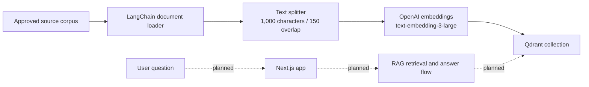

# Bhagavad Gita AI

Bhagavad Gita AI is an early-stage project for exploring questions about the Bhagavad Gita through a source-grounded conversational experience. The intended product will present relevant teachings with traceable verse references and distinguish source text from translation and modern interpretation.

## Project Status

This repository is a foundation, not a completed chat product:

- The Next.js application is scaffolded; its home page is currently a work-in-progress placeholder.
- The RAG component contains a source-ingestion prototype that splits content into chunks, creates OpenAI embeddings, and writes them to Qdrant.
- Search, answer generation, citations, evidence checks, authentication, conversation history, and voice interaction are not implemented yet.

The product and technical roadmap covers system architecture, product requirements, and implementation phases. For current ingestion configuration and commands, see the [RAG setup guide](rag/README.md).

## Architecture

The project combines a Next.js web application with a TypeScript RAG component in a pnpm workspace.

The planned system is source-grounded RAG: normalize a question, retrieve relevant approved source material, rank and check the evidence, then respond with citations or abstain when evidence is insufficient. Hybrid retrieval, reranking, answer generation, and citation validation remain roadmap items.

### Data Flow

The solid path is implemented by the indexing prototype. The dashed path is the planned user-query flow and is not implemented yet.



Today, indexing loads source documents, splits them into chunks while retaining source metadata, creates embeddings, and writes the chunks to Qdrant. The planned query flow will normalize questions, retrieve approved source material, check evidence, and answer with citations or abstain when evidence is insufficient. The current corpus is not yet normalized into stable chapter-and-verse records.

### Technology Stack

**In use:**

- Next.js 16, React 19, and TypeScript for the web application.
- pnpm 10 workspace for the root app and the `@the-bhagavad-geeta/rag` package.
- LangChain.js for document loading, text splitting, embeddings, and Qdrant integration.
- OpenAI `text-embedding-3-large` for embeddings.
- Qdrant in Docker Compose for vector storage; REST is exposed on `127.0.0.1:6335` and gRPC on `127.0.0.1:6336`.
- `dotenv` for loading root-level local configuration.

**Planned, not implemented:**

- LangGraph for explicit orchestration and bounded retries.
- Lexical/BM25 search alongside vector retrieval, followed by reranking and an evidence gate.
- PostgreSQL for users, conversations, and corpus metadata; Redis for caching and rate limits.
- Speech-to-text and text-to-speech through provider adapters, using the same grounded RAG flow.
- Retrieval tracing and evaluation for recall, citation accuracy, groundedness, latency, and cost.

## Requirements

- Node.js
- pnpm 10.33.0
- Docker with Docker Compose for local Qdrant
- An OpenAI API key to run corpus indexing

## Run the Web App

From the repository root:

```powershell
pnpm install
pnpm dev
```

Open `http://localhost:3000`.

To check the app:

```powershell
pnpm lint
pnpm build
```

## Run RAG Indexing

Create a `.env` file in the repository root:

```env
OPENAI_API_KEY=your-openai-api-key
QDRANT_URL=http://127.0.0.1:6335
```

Then start Qdrant and run the indexing package:

```powershell
docker compose up -d
pnpm --filter @the-bhagavad-geeta/rag run index
```

The Compose service exposes Qdrant REST at `127.0.0.1:6335` and gRPC at `127.0.0.1:6336`, with data persisted in the `qdrant_storage` volume. Indexing sends document text to OpenAI for embeddings and may incur API costs. The current indexing script is not yet safe for repeated runs because it does not version or deduplicate existing points.

## Product Principles

- Ground Gita-specific claims in approved source material; do not invent scripture or citations.
- Keep canonical text, translations, commentaries, and AI interpretation separate and attributable.
- Use verse-level provenance in the production corpus; the current ingestion prototype has not reached that level of normalization.
- Present the assistant as an AI guide, not as Krishna or an impersonation of a performer.
- Treat voice as a later interface to the same grounded pipeline, using licensed or consented voices.